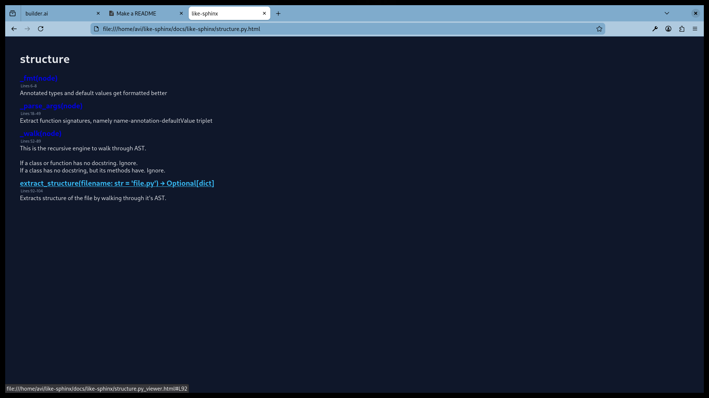
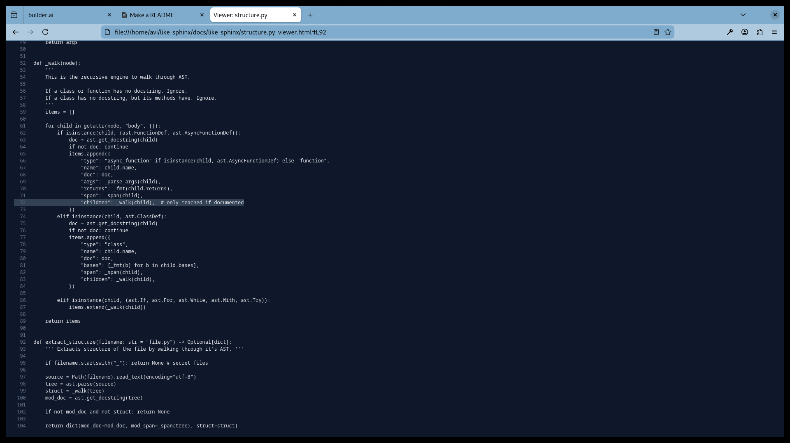

# like-sphinx

like-sphinx is a documentation tool like sphinx :)

If you need something simple to use, like-sphinx is the tool for you. It is **really** simple to use; 2 commands in total, no external configs, no dependencies. Just as you would expect.

## Installation

like-sphinx is very easy to install. Literally-

```bash
git clone github.com/thisismars-x/like-sphinx.git
cd like-sphinx
sudo bash install.sh
```

## Usage

like-sphinx generates documentation for all your files in your current working directory and links them together under your current working directory as it's package name. 

Here is how I generated **documentation for this package using ***like-sphinx***** -
```bash
>> pwd
{secret-path}/like-sphinx

# linker is the program that 
# 1) generates .html files for each individual file
# 2) links all the generated .html files under package name(which derives from pwd)
# creates html files under $HOME/like-sphinx/docs/{project-name}/
>> linker

# linker clean; cleans any previous generated .html files
>> linker clean
Cleaned all generated docs in /like-sphinx/docs

# linker then_open; generate and package html files and open them in a browser
>> linker then_open
like-sphinx ran for 0.010 ms. Excluding browser time, total(0.054ms).

```

Sure, it is not the prettiest thing out, but it is blazingly fast, and I have poor aesthetic choices. 





## License

[MIT](https://choosealicense.com/licenses/mit/)
